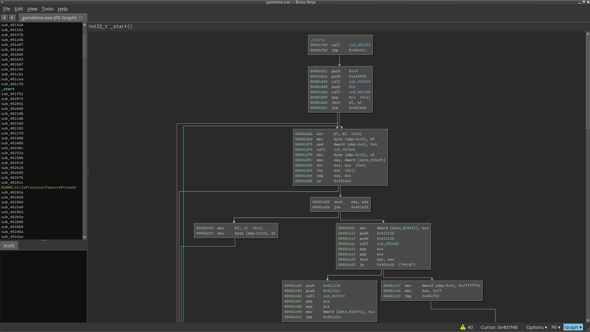
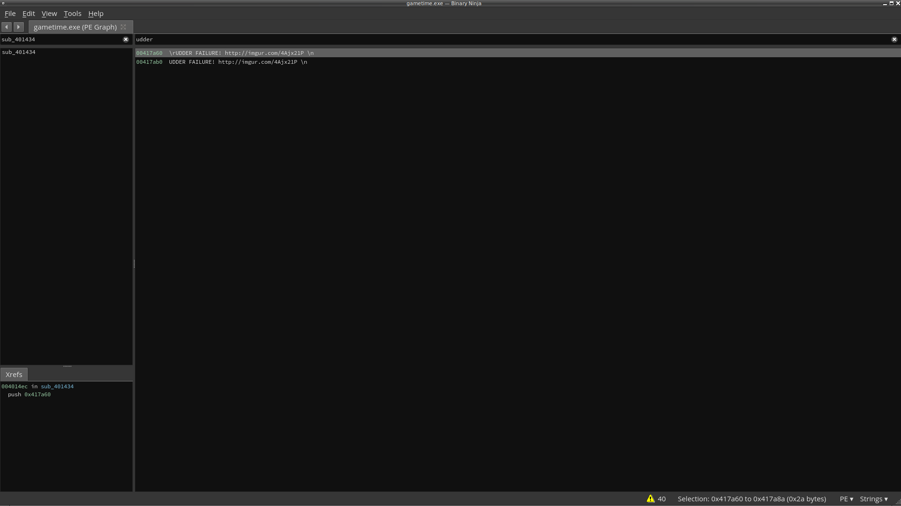
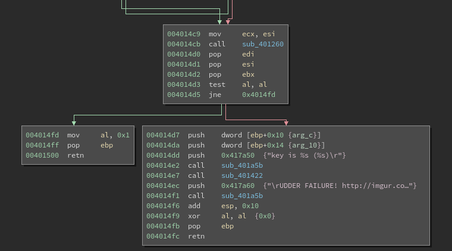
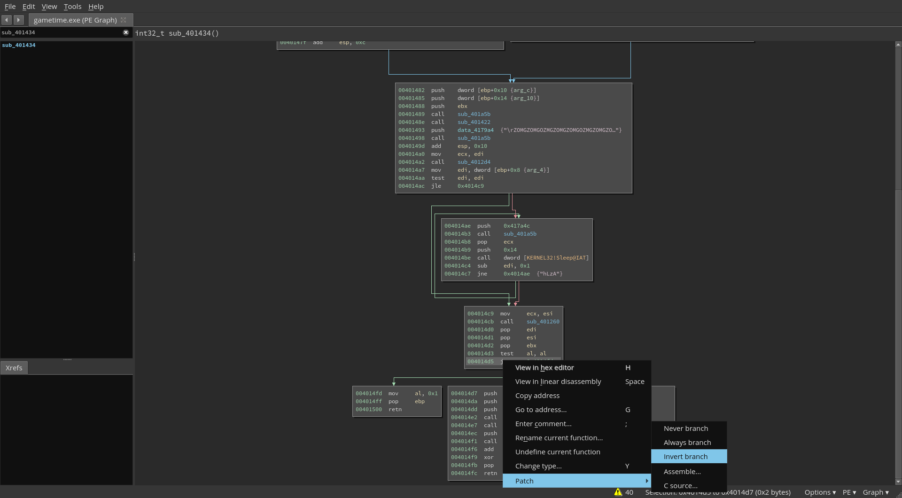

## Solving CSAW 2016's gametime.exe with Binary Ninja

So I decided to buy a personal copy of Binary Ninja after messing around with the demo a couple weeks (months?) ago as I was really impressed by it. This past weekend was CSAW and I had some time to kill, so I decided it was a great opportunity to mess with Binary Ninja a bit more. Loading up the CSAW challenges I decided to grab the first reversing challenge which was gametime.exe. 

The gametime.exe program appeared to be a game (go figure with a name like "game time", and after seeing TAP TAP REVOLUTION!!!!!!, I had a guess of what exactly it would entail).

Launching the game takes you through a brief tutorial on how exactly the play the game. The gist of it is that every couple of seconds a letter would appear on the screen and you would have to press the corresponding key, for example:

```
ZOMGZOMGOZMGZOMGZOMGOZMGZOMGZOMGOZMGZOMGZOMGOZMG

When you see an 's', press the space bar

ZOMGZOMGOZMGZOMGZOMGOZMGZOMGZOMGOZMGZOMGZOMGOZMG
Get ready to play
Get ready to play
Get ready to play
Get ready to play
Get ready to play
Get ready to play
Get ready to play
Get ready to play
Get ready to play
Get ready to play
..........s
```

And at this point in time you hit the 's' key. If you hit the key correctly, it moves onto the next letter, and so on and so forth. However, if you fail to press the key, it prints the message:

```
UDDER FAILURE! http://imgur.com/4Ajx21P
```

Once you go through the quick tutorial which makes sure you understand the concept of the game, it takes you into the actual game itself. My thought was that if you make it far enough into the game then you would be rewarded with a flag (spoiler alert! it does).

The approach I take to a lot of reverse engineering / crackme type problems is to look at the string presented at the time of failure (entering a wrong password or in this case, not typing the corresponding key), identify when that string is presented to the user (generally after failing some sort of conditional), and working from there.

At this point in time I decided to load up Binary Ninja and take a look at the binary itself. 



Selecting the drop down at the bottom right of Binary Ninja we are able to switch from Graph view to Strings view to look at the strings within the binary. By then selecting the Strings pane and starting to type we can start filtering the results very quickly to only show strings matching our filter (I absolutely love how quick and easy this is). So the string I decided to search for was "UDDER" as it was part of the error message that we receive when entering the incorrect character during the game.

Interestingly enough there are two instances of the message (one I believe is used during the training and one that is used during the actual game time, I'll mention this is just a couple minutes).



When you highlight the strings in this view you can look at the bottom left of the Binary Ninja window and see the Xrefs (where the strings are referenced). So I selected the first one (sub_401434) and took a look at it in graph view, sure enough finding the conditional statement at the bottom, one leading to the failure message, and the other leading to what would logically be the correct key press:



Another couple really nice features of Binary Ninja are the abilities to automatically invert conditional branches and the ability to easily patch binaries. So by right clicking the conditional jne and selecting "Patch -> Invert Branch" we easily turn that jne into a je:



Now we go up to the top, click File, Save Content As, and write our newly patched binary. The newly patched binary entered the tutorial phase of the game to show us how to play again; however, the difference this time was that every time the application checked to see if the correct key was pressed, the application said "Yep!", even with my hands completely off the keyboard.

I did run into a small snag though, once the application got to the actual game, it did not register me entering the correct keys. For about 10 seconds I wondered why... But then of course I remembered the two instances of the failed message! So going back into Binary Ninja I followed the same exact steps as with the previous instance, just with the second instance as well. 

Now running the (again) newly patched binary, I just had to wait for the game to run through and present me with the flag:

```
Get ready to play
Get ready to play
Get ready to play
Get ready to play
Get ready to play
Get ready to play
Get ready to play
Get ready to play
Get ready to play
Get ready to play
.....s
..x
.m
ooooh, you fancy!!!
.....m
..x
.s
key is not (NIIICE JOB)!!!!

.....m
.....m
....x
....x
.....m
....x
...s
...s
....x
.....m
TURBO TIME!

key is  (no5c30416d6cf52638460377995c6a8cf5)
```

As I expected, going through this quick challenge was extremely easy and satisfying with Binary Ninja. I'm quite thrilled to be able to add it to my toolkit and continue using it in the future.